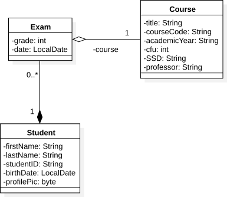

# Object Relational Mapper and Performance
A simple Java SE project to test how ORM can affect performance 

**Disclaimer**: 
This repository has the sole purpose of highlighting how a correct use of ORM can affect the performance of the whole application.
To better focus on this specific topic, the project has some questionable design choices (e.g., there is no BaseDao class and, since the project does not use CDI, the EntityManager generation, the transaction management and the rollback procedure could be encapsulated in an helper class).
For this reason, it is not recommended to take inspiration from the project as an example of good design.

## Requirements
* Maven (>=3.3.9)
* MYSQL (>=5.6)

You should also create a DB named `mysql_db` and a user with privileges on them with the subsequent credentials: 

* name: `mysql_user`
* password: `pwd`


## Domain Model


## Populating DB
To appreciate the results of some tests you may need an already populated database, to this end, you can call the helper methods in the ormExampleClass like this for example:

```java
// This order is crucial
populateCoursesDB(emFactory, 100)
populateStudDB(emFactory, 500, 18) 
```

or you may want to use the `sql.dump` also present in the repository (it contains values close to those chosen in the snippet above)

## Some Results
The results reported below were obtained with an i5-4440 CPU @ 3.10GHz

Performance measures retrieving all exams with different strategies

Student | Course | Retrieval Time (ms)
------ | ------ | ------
Eager   | Eager  | 108
Lazy   | Eager  | 32 
Lazy   | Eager + Join Fetch  | 20
 //   | DTO Class  | 8
 //   | DTO Class  | 8


Performance measures by inserting a large number of students

 \# students  | No Batching (ms) | Batching (ms)  
------ | ------    | ------
 10    |  23  | 18
 50    |  48  | 38    
 100   |  74  | 58 
 1000  |  430 | 396
 10000 | 5177 | 4425 

No evidence of benefit by flushing the persistence context


